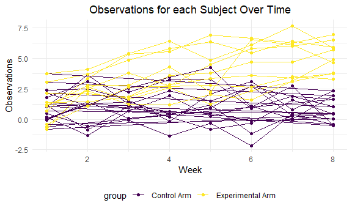

p8105\_hw5\_kdt2119
================
Kelvin Delali Tamakloe
11/19/21

\#Loading all libraries and setting themes, color schemes, and graph
output sizes

    ## -- Attaching packages --------------------------------------- tidyverse 1.3.1 --

    ## v ggplot2 3.3.5     v purrr   0.3.4
    ## v tibble  3.1.4     v dplyr   1.0.7
    ## v tidyr   1.1.3     v stringr 1.4.0
    ## v readr   2.0.1     v forcats 0.5.1

    ## -- Conflicts ------------------------------------------ tidyverse_conflicts() --
    ## x dplyr::filter() masks stats::filter()
    ## x dplyr::lag()    masks stats::lag()

## Question 1:

``` r
#Describe the raw data. Create a city_state variable (e.g. “Baltimore, MD”) and then summarize within cities to obtain the total number of homicides and the number of unsolved homicides (those for which the disposition is “Closed without arrest” or “Open/No arrest”

homicide_df = 
    read_csv("homicide-data.csv") %>% 
    mutate(
      city_state = str_c(city, state, sep = "_"),
      resolved = case_when(
        disposition == "Closed without arrest" ~ "unsolved",
        disposition == "Open/No arrest" ~ "unsolved",
        disposition == "Closed by arrest" ~ "solved"
        )
    ) %>% select(city_state,resolved) %>% 
  filter(city_state != "Tulsa_AL")
```

    ## Rows: 52179 Columns: 12

    ## -- Column specification --------------------------------------------------------
    ## Delimiter: ","
    ## chr (9): uid, victim_last, victim_first, victim_race, victim_age, victim_sex...
    ## dbl (3): reported_date, lat, lon

    ## 
    ## i Use `spec()` to retrieve the full column specification for this data.
    ## i Specify the column types or set `show_col_types = FALSE` to quiet this message.

``` r
#To find the total number of homicides:

total_hom = 
  homicide_df %>% 
  group_by(city_state) %>% 
  summarize(
    homicide_total = n(),
    homicide_unsolved = sum(resolved == "unsolved")
  )
total_hom
```

    ## # A tibble: 50 x 3
    ##    city_state     homicide_total homicide_unsolved
    ##    <chr>                   <int>             <int>
    ##  1 Albuquerque_NM            378               146
    ##  2 Atlanta_GA                973               373
    ##  3 Baltimore_MD             2827              1825
    ##  4 Baton Rouge_LA            424               196
    ##  5 Birmingham_AL             800               347
    ##  6 Boston_MA                 614               310
    ##  7 Buffalo_NY                521               319
    ##  8 Charlotte_NC              687               206
    ##  9 Chicago_IL               5535              4073
    ## 10 Cincinnati_OH             694               309
    ## # ... with 40 more rows

``` r
#For the city of Baltimore, MD, use the prop.test function to estimate the proportion of homicides that are unsolved; save the output of prop.test as an R object, apply the broom::tidy to this object and pull the estimated proportion and confidence intervals from the resulting tidy dataframe.

baltimore_df = total_hom %>% 
  filter(city_state == "Baltimore_MD")  
proportion = prop.test(
    x = baltimore_df %>% pull(homicide_unsolved),
    n = baltimore_df %>% pull(homicide_total))

#The sample estimates: 0.6455607; The 95% CI: (0.6276,0.6632)

proportion %>%
  broom::tidy() 
```

    ## # A tibble: 1 x 8
    ##   estimate statistic  p.value parameter conf.low conf.high method    alternative
    ##      <dbl>     <dbl>    <dbl>     <int>    <dbl>     <dbl> <chr>     <chr>      
    ## 1    0.646      239. 6.46e-54         1    0.628     0.663 1-sample~ two.sided

``` r
#Now run prop.test for each of the cities in your dataset, and extract both the proportion of unsolved homicides and the confidence interval for each. Do this within a “tidy” pipeline, making use of purrr::map, purrr::map2, list columns and unnest as necessary to create a tidy dataframe with estimated proportions and CIs for each city.

allcities_df = 
  total_hom %>% 
  mutate(
    prop_tests = map2(.x = homicide_unsolved, .y = homicide_total, ~prop.test(x = .x, n = .y)),
    tidy_tests = map(.x = prop_tests, ~broom::tidy(.x))
  ) %>% 
  select(-prop_tests) %>% 
  unnest(tidy_tests) %>% 
  select(city_state, estimate, conf.low, conf.high)
allcities_df
```

    ## # A tibble: 50 x 4
    ##    city_state     estimate conf.low conf.high
    ##    <chr>             <dbl>    <dbl>     <dbl>
    ##  1 Albuquerque_NM    0.386    0.337     0.438
    ##  2 Atlanta_GA        0.383    0.353     0.415
    ##  3 Baltimore_MD      0.646    0.628     0.663
    ##  4 Baton Rouge_LA    0.462    0.414     0.511
    ##  5 Birmingham_AL     0.434    0.399     0.469
    ##  6 Boston_MA         0.505    0.465     0.545
    ##  7 Buffalo_NY        0.612    0.569     0.654
    ##  8 Charlotte_NC      0.300    0.266     0.336
    ##  9 Chicago_IL        0.736    0.724     0.747
    ## 10 Cincinnati_OH     0.445    0.408     0.483
    ## # ... with 40 more rows

``` r
#Create a plot that shows the estimates and CIs for each city – check out geom_errorbar for a way to add error bars based on the upper and lower limits. Organize cities according to the proportion of unsolved homicides.

allcities_df %>% 
  mutate(city_state = fct_reorder(city_state, estimate)) %>% 
  ggplot(aes(x = city_state, y = estimate)) +
  geom_point() + 
  geom_errorbar(aes(ymin = conf.low, ymax = conf.high)) +
  theme(axis.text.x = element_text(angle = 90, vjust = 0.5, hjust = 1))
```


The raw data from the Washington Post homicide dataset includes 52178
rows and 2 columns and is focused on unsolved homicides throughout the
United States. The dataset includes the victims’ first and last names,
their race, age, sex, the reported date of the homicide, city and state
in which the homicide occurred, as well as a unique ID. The data is
already relatively clean.

The dataset has records for 52,129 homicides from 50 cities in the
United States. The dataset has 12 columns and includes variables such as
victim\_race, victim\_last, victim\_first, victim\_age, victim\_sex,
reported\_date and uid.

Post data cleaning and creation of the city\_state variable, there are
only 2 variables and a total of 52,128 observations.The total number of
homicides and the total number of uncilved homicides in each city\_state
is contained in the tital\_hom data frame.

Baltimore has a sample estimate of 0.6455607. The 95% CI has an upper
bound of 0.6276 and a lower bound of 0.6632.

## Question 2

Create a tidy dataframe containing data from all participants, including
the subject ID, arm, and observations over time. 1) Start with a
dataframe containing all file names; 2) Iterate over file names and read
in data for each subject using purrr::map and saving the result as a new
variable in the dataframe, 3) Tidy the result; manipulate file names to
include control arm and subject ID, make sure weekly observations are
“tidy”, and do any other tidying that’s necessary

``` r
#To load the data from the relevant file in the repository, and merge spreadsheet to create list.

hw5data = 
  tibble(
    path = list.files("hw5_data")) %>% 
  mutate(
    path = str_c("hw5_data/", path), 
    data = map(path, read_csv) 
     ) %>% 
  unnest(data) %>%
  mutate(
    path = str_replace(path, "hw5_data/", " "), #
    path = str_replace(path, ".csv", " ")
    ) %>%
  separate(path, into = c("group","Subject_ID"),sep = "_")
```

    ## Rows: 1 Columns: 8

    ## -- Column specification --------------------------------------------------------
    ## Delimiter: ","
    ## dbl (8): week_1, week_2, week_3, week_4, week_5, week_6, week_7, week_8

    ## 
    ## i Use `spec()` to retrieve the full column specification for this data.
    ## i Specify the column types or set `show_col_types = FALSE` to quiet this message.

    ## Rows: 1 Columns: 8

    ## -- Column specification --------------------------------------------------------
    ## Delimiter: ","
    ## dbl (8): week_1, week_2, week_3, week_4, week_5, week_6, week_7, week_8

    ## 
    ## i Use `spec()` to retrieve the full column specification for this data.
    ## i Specify the column types or set `show_col_types = FALSE` to quiet this message.

    ## Rows: 1 Columns: 8

    ## -- Column specification --------------------------------------------------------
    ## Delimiter: ","
    ## dbl (8): week_1, week_2, week_3, week_4, week_5, week_6, week_7, week_8

    ## 
    ## i Use `spec()` to retrieve the full column specification for this data.
    ## i Specify the column types or set `show_col_types = FALSE` to quiet this message.

    ## Rows: 1 Columns: 8

    ## -- Column specification --------------------------------------------------------
    ## Delimiter: ","
    ## dbl (8): week_1, week_2, week_3, week_4, week_5, week_6, week_7, week_8

    ## 
    ## i Use `spec()` to retrieve the full column specification for this data.
    ## i Specify the column types or set `show_col_types = FALSE` to quiet this message.

    ## Rows: 1 Columns: 8

    ## -- Column specification --------------------------------------------------------
    ## Delimiter: ","
    ## dbl (8): week_1, week_2, week_3, week_4, week_5, week_6, week_7, week_8

    ## 
    ## i Use `spec()` to retrieve the full column specification for this data.
    ## i Specify the column types or set `show_col_types = FALSE` to quiet this message.

    ## Rows: 1 Columns: 8

    ## -- Column specification --------------------------------------------------------
    ## Delimiter: ","
    ## dbl (8): week_1, week_2, week_3, week_4, week_5, week_6, week_7, week_8

    ## 
    ## i Use `spec()` to retrieve the full column specification for this data.
    ## i Specify the column types or set `show_col_types = FALSE` to quiet this message.

    ## Rows: 1 Columns: 8

    ## -- Column specification --------------------------------------------------------
    ## Delimiter: ","
    ## dbl (8): week_1, week_2, week_3, week_4, week_5, week_6, week_7, week_8

    ## 
    ## i Use `spec()` to retrieve the full column specification for this data.
    ## i Specify the column types or set `show_col_types = FALSE` to quiet this message.

    ## Rows: 1 Columns: 8

    ## -- Column specification --------------------------------------------------------
    ## Delimiter: ","
    ## dbl (8): week_1, week_2, week_3, week_4, week_5, week_6, week_7, week_8

    ## 
    ## i Use `spec()` to retrieve the full column specification for this data.
    ## i Specify the column types or set `show_col_types = FALSE` to quiet this message.

    ## Rows: 1 Columns: 8

    ## -- Column specification --------------------------------------------------------
    ## Delimiter: ","
    ## dbl (8): week_1, week_2, week_3, week_4, week_5, week_6, week_7, week_8

    ## 
    ## i Use `spec()` to retrieve the full column specification for this data.
    ## i Specify the column types or set `show_col_types = FALSE` to quiet this message.

    ## Rows: 1 Columns: 8

    ## -- Column specification --------------------------------------------------------
    ## Delimiter: ","
    ## dbl (8): week_1, week_2, week_3, week_4, week_5, week_6, week_7, week_8

    ## 
    ## i Use `spec()` to retrieve the full column specification for this data.
    ## i Specify the column types or set `show_col_types = FALSE` to quiet this message.

    ## Rows: 1 Columns: 8

    ## -- Column specification --------------------------------------------------------
    ## Delimiter: ","
    ## dbl (8): week_1, week_2, week_3, week_4, week_5, week_6, week_7, week_8

    ## 
    ## i Use `spec()` to retrieve the full column specification for this data.
    ## i Specify the column types or set `show_col_types = FALSE` to quiet this message.

    ## Rows: 1 Columns: 8

    ## -- Column specification --------------------------------------------------------
    ## Delimiter: ","
    ## dbl (8): week_1, week_2, week_3, week_4, week_5, week_6, week_7, week_8

    ## 
    ## i Use `spec()` to retrieve the full column specification for this data.
    ## i Specify the column types or set `show_col_types = FALSE` to quiet this message.

    ## Rows: 1 Columns: 8

    ## -- Column specification --------------------------------------------------------
    ## Delimiter: ","
    ## dbl (8): week_1, week_2, week_3, week_4, week_5, week_6, week_7, week_8

    ## 
    ## i Use `spec()` to retrieve the full column specification for this data.
    ## i Specify the column types or set `show_col_types = FALSE` to quiet this message.

    ## Rows: 1 Columns: 8

    ## -- Column specification --------------------------------------------------------
    ## Delimiter: ","
    ## dbl (8): week_1, week_2, week_3, week_4, week_5, week_6, week_7, week_8

    ## 
    ## i Use `spec()` to retrieve the full column specification for this data.
    ## i Specify the column types or set `show_col_types = FALSE` to quiet this message.

    ## Rows: 1 Columns: 8

    ## -- Column specification --------------------------------------------------------
    ## Delimiter: ","
    ## dbl (8): week_1, week_2, week_3, week_4, week_5, week_6, week_7, week_8

    ## 
    ## i Use `spec()` to retrieve the full column specification for this data.
    ## i Specify the column types or set `show_col_types = FALSE` to quiet this message.

    ## Rows: 1 Columns: 8

    ## -- Column specification --------------------------------------------------------
    ## Delimiter: ","
    ## dbl (8): week_1, week_2, week_3, week_4, week_5, week_6, week_7, week_8

    ## 
    ## i Use `spec()` to retrieve the full column specification for this data.
    ## i Specify the column types or set `show_col_types = FALSE` to quiet this message.

    ## Rows: 1 Columns: 8

    ## -- Column specification --------------------------------------------------------
    ## Delimiter: ","
    ## dbl (8): week_1, week_2, week_3, week_4, week_5, week_6, week_7, week_8

    ## 
    ## i Use `spec()` to retrieve the full column specification for this data.
    ## i Specify the column types or set `show_col_types = FALSE` to quiet this message.

    ## Rows: 1 Columns: 8

    ## -- Column specification --------------------------------------------------------
    ## Delimiter: ","
    ## dbl (8): week_1, week_2, week_3, week_4, week_5, week_6, week_7, week_8

    ## 
    ## i Use `spec()` to retrieve the full column specification for this data.
    ## i Specify the column types or set `show_col_types = FALSE` to quiet this message.

    ## Rows: 1 Columns: 8

    ## -- Column specification --------------------------------------------------------
    ## Delimiter: ","
    ## dbl (8): week_1, week_2, week_3, week_4, week_5, week_6, week_7, week_8

    ## 
    ## i Use `spec()` to retrieve the full column specification for this data.
    ## i Specify the column types or set `show_col_types = FALSE` to quiet this message.

    ## Rows: 1 Columns: 8

    ## -- Column specification --------------------------------------------------------
    ## Delimiter: ","
    ## dbl (8): week_1, week_2, week_3, week_4, week_5, week_6, week_7, week_8

    ## 
    ## i Use `spec()` to retrieve the full column specification for this data.
    ## i Specify the column types or set `show_col_types = FALSE` to quiet this message.

``` r
hw5data_ =
  hw5data %>% 
  pivot_longer(
    week_1:week_8,
    names_to = "Week", 
    names_prefix = "week_", 
    values_to = "Observations"
  ) %>%
  mutate(
    group = str_replace(group, "exp", "Experimental Arm"),
    group = str_replace(group, "con", "Control Arm"),
  ) %>%
  relocate(Subject_ID)

#To make a spaghetti plot showing observations for each subject over time

hw5data_ %>% 
  mutate(Week = as.numeric(Week)) %>%
  ggplot(aes(x = Week, y = Observations, color = group)) +
  geom_path(aes(group = Subject_ID)) +
  geom_point() +
  theme(plot.title = element_text(hjust = 0.5)) +
  labs(
      title = "Observations for each Subject Over Time",
      x = "Week",
      y = "Observations"
      )
```



The charts above show observations over time as delineated by study arm.
It can be noted that subjects in the control arm appear to report
largely the same observation over time while subjects in the
experimental arm appear to report a higher number of observations as
time goes on.
